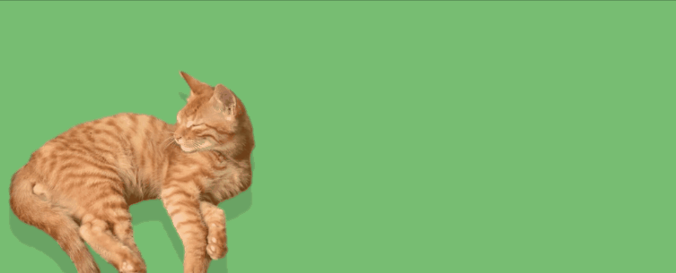
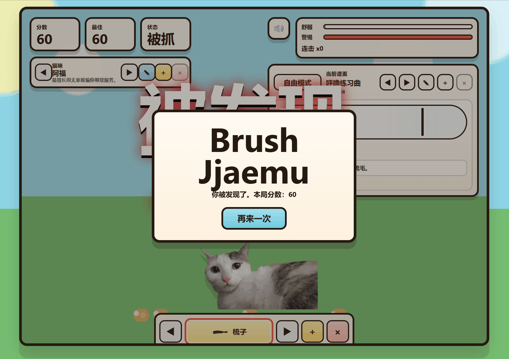

# 🐱 pet-beamer — 节奏梳毛游戏
**借鉴网站https://byeorisim.itch.io/brush-jjaemu 制作梳毛部分，借鉴bits and bots制作节奏部分**
> 一款融合了 **节奏音游** 与 **虚拟宠物** 的网页小游戏。  
> 用鼠标或键盘给猫咪梳毛，跟上节拍，赢取高分，解锁更多猫咪和歌曲！

🎮 **在线试玩**：[[点击这里](https://iszombie0308.github.io/pet-beamer/)]
📦 **项目仓库**：[[GitHub 链接](https://github.com/isZombie0308/pet-beamer)]

---

## ✨ 特性

- 🐈 **多只猫咪可选**：内置 10 种不同性格的猫咪，每只猫的“警觉度”和“回头频率”都不同。
- 🎵 **节奏模式 + 自由模式**：
  - 自由模式：匀速梳理猫咪，小心它回头抓伤你。
  - 节奏模式：跟随节拍按下 `J/F`（普通拍）或 `K/D`（重拍），空拍时及时收手，避开“回头”与“偷看”。
- 🛠️ **可自定义内容**：
  - 上传本地图片制作专属猫咪（平静图 & 警惕图）。
  - 导入音频文件，自动分析 BPM 并生成节拍谱面（或手动编辑）。
  - 更换梳子、锄头等工具，甚至上传自定义工具图片。
- 💾 **本地持久化**：所有自定义猫、歌曲、工具数据都会存入 IndexedDB / LocalStorage，关闭页面不丢失。
- 🔊 **沉浸式音效**：梳毛沙沙声、节拍提示音、连击欢呼声，全部由 Web Audio API 实时合成。
- 📱 **响应式设计**：支持 PC 鼠标/键盘与手机触摸屏，自适应布局。

---

## 🛠️ 技术栈

| 类别       | 技术                                                                                                  |
| ---------- | ---------------------------------------------------------------------------------------------------- |
| 前端基础   | HTML5 / CSS3 / JavaScript (ES6+)                                                                      |
| 音频引擎   | Web Audio API（动态合成音效、节拍调度）                                                                  |
| 存储       | IndexedDB + LocalStorage                                                                              |
| 节拍检测   | [`web-audio-beat-detector`](https://www.npmjs.com/package/web-audio-beat-detector)（自动分析音乐 BPM）  |
| 开发工具   | Cursor（AI 辅助编程，Vibe Coding 工作流）                                                               |

---

## 🚀 如何本地运行

1. **克隆仓库**
   ```bash
   git clone https://github.com/isZombie0308/pet-beamer
   cd pet-beamer
启动本地服务器（必须通过 HTTP 服务运行，否则 Web Audio 和 IndexedDB 可能受限）

bash
# 使用 Python 3
python -m http.server 8080
# 或使用 Live Server（VS Code 插件）
打开浏览器访问 http://localhost:8080

⚠️ 注意：项目依赖 assets 目录下的图片资源（猫咪图、工具图）。如果图片缺失，控制台会报错，但游戏仍可运行（内置兜底头像）。你可以用自己的图片替换。

🎮 游戏玩法
自由模式
按住鼠标左键（或手指触摸）在猫咪身上移动，速度太慢会降低好感，太快会激怒猫咪。

屏幕上的“舒服 / 警惕”条会实时反馈。当舒适度满时获得额外分数，警惕度满会被猫爪。

猫咪会随机回头，此时必须立刻停止梳毛，否则直接失败。

节奏模式
点击「节奏模式」按钮进入。

选择一首内置歌曲，或自己导入音频并生成谱面。

根据屏幕上的节拍预览轨道，按对应的键盘按键：

J 或 F：普通拍（Tap）

K 或 D：重拍（Accent）

遇到「回头」(L) 或「偷看」(S) 事件时必须松开所有按键，停手等待。

准确命中节拍可累加连击、增加分数。空拍或按错会打断连击并增加警惕度。

完整演奏歌曲后自动结算，获得评价（SS ~ D）。

🧩 自定义内容
添加自定义猫咪
点击猫咪区域旁的「+」按钮。

上传 平静状态图 和 警惕状态图（推荐透明背景 PNG）。

填写名字和介绍，即可在游戏中使用。

添加自定义歌曲
点击歌曲区域旁的「+」按钮。

填写曲名、BPM（也可选择“自动识别”，上传音频后自动分析）。

手动编写节拍序列（例如 1,0,2,S,1,0,L,0）。

支持上传音频文件，自动播放。

更换 / 上传工具
点击底部工具栏的「+」上传本地图片作为新工具。

工具图标会改变鼠标样式和梳毛时的幽灵图像。

📸 游戏演示

你可以在下面看到游戏的运行效果：





游戏主界面，上方显示分数、最佳、猫咪状态，下方是节奏控制面板。

🤝 参与贡献
欢迎提出 Issue 或 Pull Request！如果你也想为游戏增加新特性（比如更多猫咪、在线排行榜、音效优化等），请联系作者。


🙏 致谢
猫咪插图来源于互联网（仅供学习交流，若侵权请联系删除）。

节奏检测库 web-audio-beat-detector。

本项目采用 Vibe Coding 方式开发，大量使用 Codex 和 Claude Code 辅助完成。
